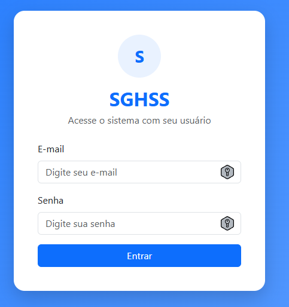
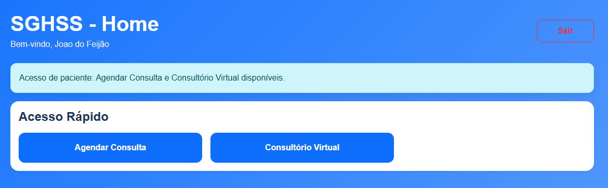
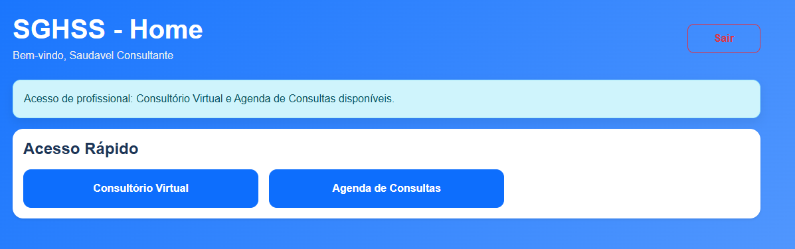
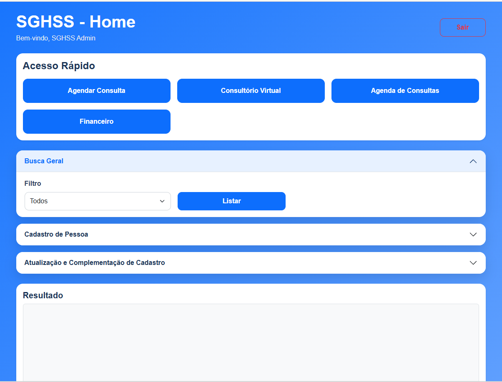
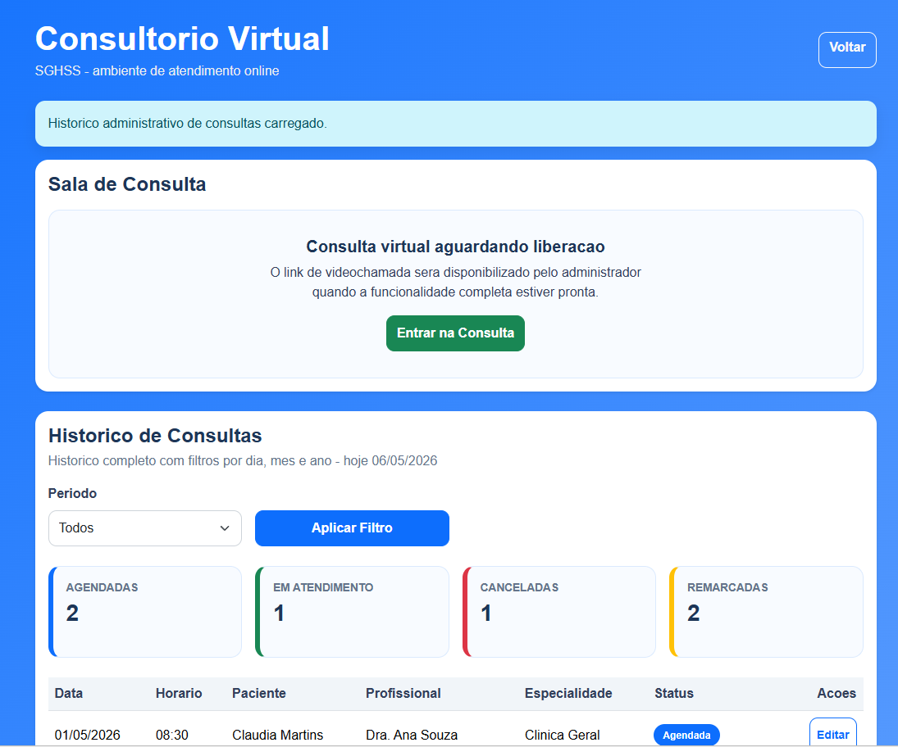
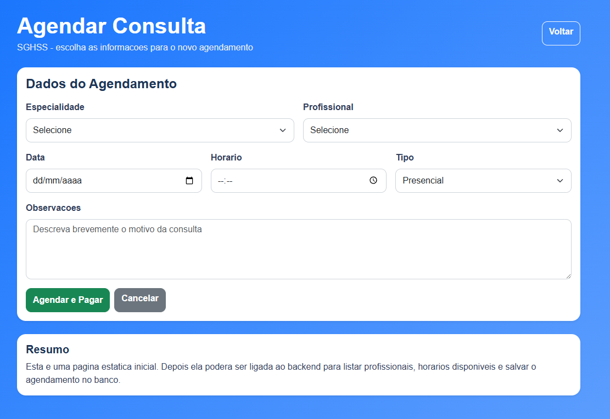
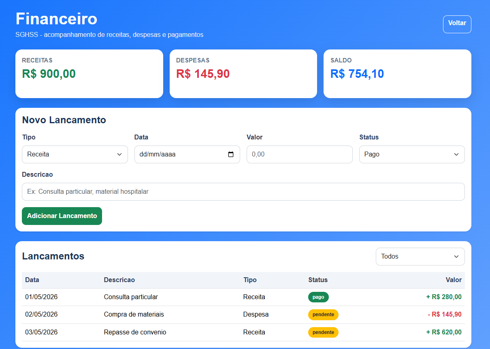

# SGHSS API

Sistema SGHSS desenvolvido em ASP.NET Core com Entity Framework Core e MySQL.

O projeto entrega uma API REST e também uma interface web integrada feita com HTML, CSS, JavaScript e Bootstrap, servida pela própria aplicação a partir da pasta `wwwroot`. A interface possui tela de login e tela principal para testar os fluxos do sistema.

## Objetivos do Projeto

### Objetivo geral

Desenvolver um sistema de gestão hospitalar e de serviços de saúde capaz de centralizar cadastros, controlar acessos e apoiar os principais fluxos administrativos e assistenciais de uma instituição de saúde.

### Objetivos específicos

- Organizar o cadastro de pessoas, pacientes e profissionais de saúde, mantendo os vínculos necessários entre dados pessoais e perfis assistenciais.
- Controlar o acesso ao sistema por meio de login, senha, token JWT, usuários ativos e perfis de permissão.
- Priorizar os módulos essenciais de administração, pacientes e profissionais de saúde, permitindo cadastro, consulta, atualização e exclusão lógica dos registros.
- Preparar a base do sistema para fluxos operacionais de atendimento, como agendamentos, consultório e financeiro, integrando essas áreas aos usuários e cadastros principais.
- Aplicar boas práticas de segurança e proteção de dados, considerando informações pessoais e sensíveis tratadas pelo sistema.

## Pré-requisitos
- Visual Studio Code ou IDE Similar para .Net
- [.NET SDK 9](https://learn.microsoft.com/dotnet/core/install/windows)
procure e baixe a versão 9.0.15.
- C# Dev Kit extensão do VSCode
- [Docker Desktop](https://docs.docker.com/desktop/setup/install/windows-install/)
- [Git](https://git-scm.com/downloads)
- Navegador de Internet, como Chrome, Edge ou Firefox

Para conferir se as ferramentas foram instaladas corretamente:

```bash
dotnet --version
docker --version
docker compose version
git --version
```

## Como rodar o projeto

### 1. Clonar o repositório

```bash
git clone https://github.com/EverdAndre/ProjetoSGHSS
cd ProjetoSGHSS
```

### 2. Subir o banco MySQL com Docker

Na raiz do projeto, execute:

```bash
docker compose up -d
```

O `docker-compose.yml` sobe um MySQL local com:

```txt
Host: localhost
Porta: 3306
Banco: sghss
Usuario: everd
Senha: 2014
```

Se quiser recriar o banco do zero, apagando os dados anteriores:

```bash
docker compose down -v
docker compose up -d
```

### 3. Configurar a connection string

O projeto usa `user-secrets` para evitar salvar a connection string no Git.

Execute na raiz do projeto:

```bash
dotnet user-secrets set "ConnectionStrings:DefaultConnection" "Server=localhost;Port=3306;Database=sghss;User=everd;Password=2014;" --project SGHSS.Api
```

Para conferir os segredos configurados:

```bash
dotnet user-secrets list --project SGHSS.Api
```

Para testar login e gerar token JWT, configure também:

```bash
dotnet user-secrets set "Jwt:Key" "Ate_Aqui_n0s_gu@rdou_0_S&nh0r_._2026" --project SGHSS.Api
dotnet user-secrets set "Seed:AdminPassword" "Admin@123" --project SGHSS.Api
```

### 4. Rodar a API

```bash
dotnet run --project .\SGHSS.Api\SGHSS.Api.csproj --launch-profile https
```

Ao iniciar, a API aplica as migrations automaticamente e cria um usuário admin inicial em ambiente de desenvolvimento.

### 5. Acessar o Swagger

Abra no navegador:

```txt
https://localhost:7192/swagger/index.html
```

Se a porta exibida no terminal for diferente, use a URL mostrada pelo `dotnet run`.

### 6. Acessar a interface da aplicação

A aplicação também possui interface web com tela de login.

Abra no navegador:

```txt
https://localhost:7192/pages/login.html
```

Se a porta exibida no terminal for diferente, use a mesma porta mostrada pelo `dotnet run`.

Exemplo:

```txt
https://localhost:<porta>/pages/login.html
```

## Usuário inicial

Quando o banco estiver vazio, o projeto cria automaticamente este usuário:

```txt
Email: admin@sghss.com
Senha: Admin@123
Perfil: Admin
```

Use esse usuário no endpoint de login para obter o token JWT.

## Acesso como Paciente ou Profissional de Saúde

Para acessar a interface como `Paciente` ou `ProfissionalSaude`, primeiro é necessário entrar como administrador e preparar o cadastro dessa pessoa.

Fluxo recomendado pela interface web:

1. Acesse `/pages/login.html` usando o usuário administrador inicial.
2. Na Home, cadastre uma nova pessoa com nome, CPF, data de nascimento, endereço e telefone.
3. Busque ou selecione essa pessoa na área de atualização de cadastro.
4. No campo de perfil complementar, escolha `Paciente` ou `Profissional de Saude`.
5. Preencha os dados específicos do perfil escolhido e salve.
6. Ainda com a mesma pessoa selecionada, cadastre o usuário com email, senha e o mesmo perfil correspondente.
7. Saia da conta admin.
8. Entre novamente na tela de login usando o email e senha cadastrados para essa pessoa.

Esse fluxo é necessário porque o sistema separa o cadastro da pessoa, o perfil assistencial e o usuário de acesso. Assim, um login de paciente precisa estar vinculado a uma pessoa que também possui cadastro de paciente, e um login de profissional precisa estar vinculado a uma pessoa que também possui cadastro de profissional de saúde.

## LGPD e proteção dos dados

O SGHSS trata dados pessoais e dados sensíveis de saúde, por isso o projeto adota controles de acesso e proteções técnicas alinhadas aos princípios da LGPD, como necessidade, segurança, prevenção e controle de acesso. A documentação abaixo descreve as proteções implementadas no projeto, mas não substitui uma avaliação jurídica completa de conformidade.

Principais proteções usadas:

- Autenticação por login e senha em `POST /api/Auth/login`.
- Senhas armazenadas como hash usando BCrypt, sem gravar a senha original no banco.
- Geração de token JWT após login válido, com tempo de expiração configurável em `Jwt:ExpiresInHours`.
- Endpoints protegidos com `[Authorize]`, exigindo token Bearer para acesso.
- Restrição por perfil de usuário com `[Authorize(Roles = "...")]`, separando permissões de `Admin`, `ProfissionalSaude` e `Paciente`.
- Cadastro de usuário vinculado a uma pessoa, com índices únicos para email e para o relacionamento entre usuário e pessoa.
- Validação para impedir perfis incompatíveis com o cadastro assistencial da pessoa. Por exemplo, um usuário `Paciente` precisa estar vinculado a uma pessoa cadastrada como paciente.
- Controle de usuário ativo/inativo. Usuários inativos não conseguem realizar login.
- Uso de `user-secrets` para manter connection string, chave JWT e senha inicial fora do versionamento do Git.
- Execução em HTTPS no perfil de desenvolvimento, reduzindo exposição dos dados trafegados localmente.

### Login com restrição por usuário

O acesso ao sistema não é aberto: cada pessoa que utiliza a aplicação precisa ter um usuário próprio, com email, senha, perfil e status ativo. No login, a API valida se o usuário existe, se está ativo e se a senha corresponde ao hash armazenado.

Quando o login é aprovado, o token JWT gerado inclui dados de identificação como `IdUsuario`, `IdPessoa`, email, nome e perfil. A partir desse token, a API aplica as restrições de acesso por perfil. Assim, operações administrativas, como cadastrar, listar, alterar ou excluir usuários, pessoas, pacientes e profissionais, ficam restritas ao perfil `Admin`.

Essa separação evita que um usuário acesse funcionalidades fora do seu perfil e ajuda a reduzir o risco de acesso indevido a dados pessoais e informações de saúde.

## Testando pela própria interface

A aplicação pode ser testada pela própria interface web, sem precisar de outro sistema cliente.

### 1. Entrar na tela de login

Acesse:

```txt
https://localhost:<porta>/pages/login.html
```

Use o usuário inicial:

```txt
Email: admin@sghss.com
Senha: Admin@123
```

Após o login, a aplicação redireciona para a tela principal:

```txt
/pages/home.html
```

### 2. Criar uma pessoa pela tela principal

Na tela principal, use o formulário de cadastro de pessoa.

Informe os dados básicos, como nome, CPF, data de nascimento, endereço e telefone.

Depois de salvar, busque ou selecione a pessoa cadastrada na própria tela.

### 3. Criar um usuário pela tela principal

Com a pessoa selecionada, escolha o perfil complementar de usuário, informe email, senha e perfil, e salve.

Perfis disponíveis:

```txt
1 = Admin
2 = ProfissionalSaude
3 = Paciente
```

Para criar usuário com perfil `Paciente`, primeiro cadastre o perfil de paciente para a pessoa.

Para criar usuário com perfil `ProfissionalSaude`, primeiro cadastre o perfil de profissional para a pessoa.

Depois disso, crie o usuário usando o mesmo cadastro de pessoa e o perfil correspondente.

## Testando pelo Swagger

Também é possível testar diretamente pelo Swagger.

### 1. Fazer login

No Swagger, acesse:

```txt
POST /api/Auth/login
```

Use o usuário inicial:

```json
{
  "email": "admin@sghss.com",
  "senha": "Admin@123"
}
```

A resposta retorna um campo `token`.

### 2. Autorizar no Swagger

Clique no botão `Authorize` no topo do Swagger e cole o token retornado no login.

Depois disso, os endpoints protegidos ficam liberados para teste.

### 3. Criar uma pessoa

Antes de criar um usuário novo, é necessário criar uma pessoa.

Use:

```txt
POST /api/Pessoas
```

Exemplo:

```json
{
  "nome": "Usuario Teste",
  "cpf": "12345678901",
  "dataNascimento": "1990-01-01T00:00:00",
  "endereco": "Rua Teste, 123",
  "telefone": "11999999999"
}
```

Guarde o `idPessoa` retornado.

### 4. Criar um usuário

Para criar um usuário administrador, use:

```txt
POST /api/Usuarios
```

Exemplo:

```json
{
  "idPessoa": 2,
  "email": "teste@sghss.com",
  "senha": "Teste123",
  "perfil": 1
}
```

Valores de `perfil`:

```txt
1 = Admin
2 = ProfissionalSaude
3 = Paciente
```

Para criar usuário com perfil `Paciente`, primeiro crie a pessoa e depois cadastre o paciente em:

```txt
POST /api/Paciente/pessoa/{idPessoa}
```

Para criar usuário com perfil `ProfissionalSaude`, primeiro crie a pessoa e depois cadastre o profissional em:

```txt
POST /api/Profissional/pessoa/{idPessoa}
```

Depois disso, crie o usuário em `POST /api/Usuarios` usando o mesmo `idPessoa` e o perfil correspondente.

## Comandos úteis

Aplicar migrations manualmente:

```bash
dotnet ef database update --project SGHSS.Api
```

Parar o banco:

```bash
docker compose down
```

Parar e apagar os dados do banco:

```bash
docker compose down -v
```
## Telas principais

### Login


### Dashboard do paciente


### Dashboard do profissional de saúde


### Dashboard do Admin


### Consultório


### Agenda


### Financeiro

